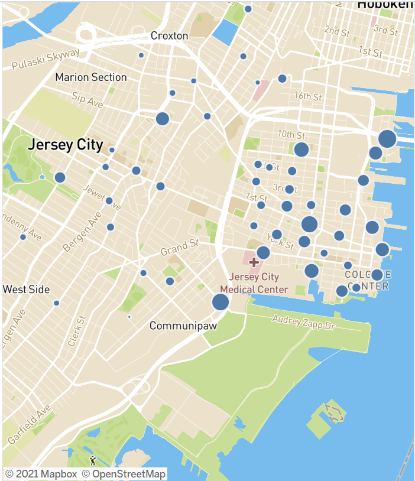

# Tableau - Citi Bike Analytics

The purpose of this assignment was to aggregate data found in the Citi Bike Trip History Logs, analyze that data, and find two unexpected phenomena. The questions I wanted to take a look at were: If Co-Vid 19 had affected the popularity of the bike share program and what specific demographic primarily used the bikes.

## Data Collection

I pulled this data from the [Citi Bike Data](https://www.citibikenyc.com/system-data) webpage and used 2 data sets (July 2019 (201907-citibike-tripdata.csv.zip) and July 2020 (202007-citibike-tripdata.csv.zip)

## Data Cleaning
After I downloaded these datasets, I opened them in Tableau and created a join to merge datasets.

## What was the comparison between July 2019 and 2020?

Creating multiple sheets in Tableau to make a virtual dashboard between the 2 years I discovered that the there were more trips in July 19, but way more time spent on bikes in July 20. Not getting a clear picture of weather or not Co-vid played any part, I wanted to create more visualizations to dive further into data analysis.

## Data Analysis

Seeing highs and lows on daily usage, I determined that citi bike could be a primary mean of transportation for workers in New York City as the usage was significantly higher during the week compared to the weekend.

In addition we took a closer look at station popularity and demographics of user to get a better understanding of who the primary users were, and what stations were the most popular (via mapping through mapbox)

## Visualization

After creating multiple dashboards via Tableau, I created a story with my findings. I have posted link below to view full story.

## Conclusion

No strong link between Co-vid 19 and Citi Bike usage, however determined that it high probablity that working class are primary users, based on daily usage and age of users.  

### *URL TO MY COMPLETED TABLEAU PUBLIC WORKBOOK*
https://public.tableau.com/app/profile/matt.weiper/viz/citibikeassignment/CitiBikeAnalysis

Contact
mattweiper@gmail.com
